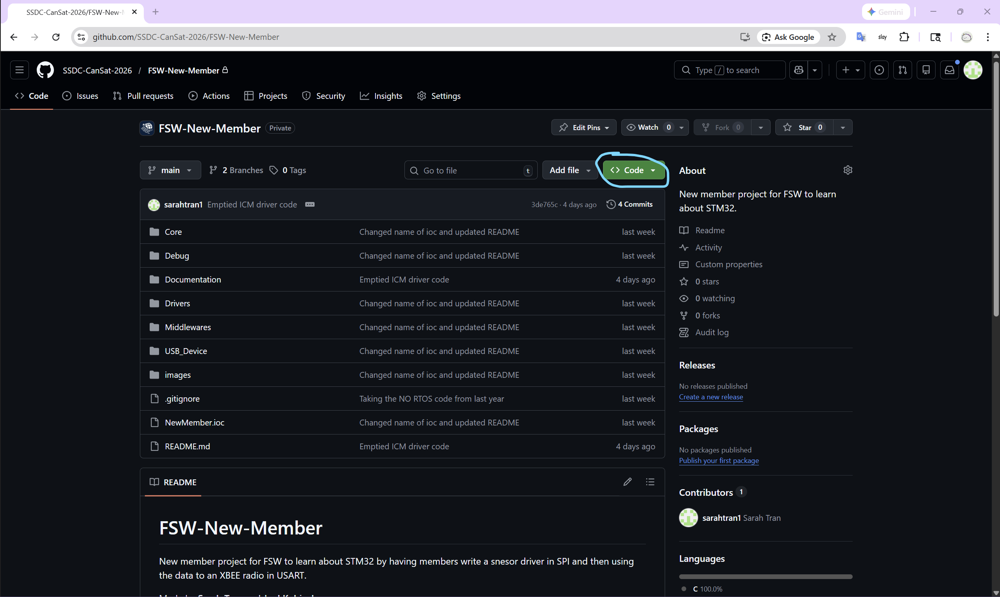
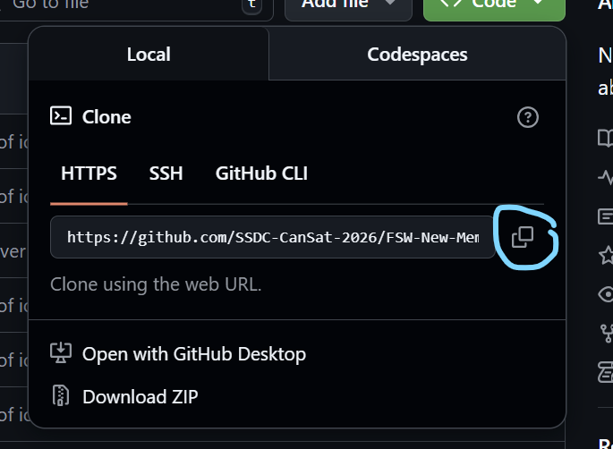
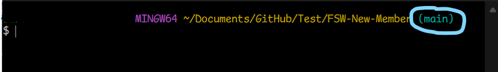
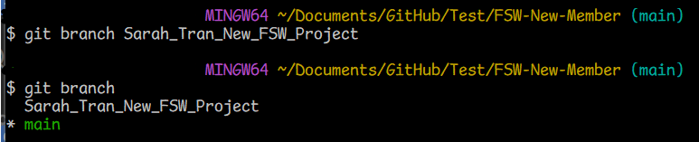
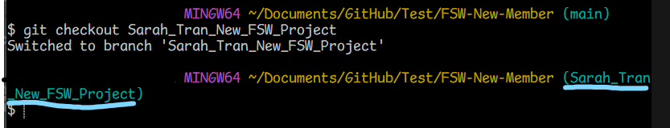
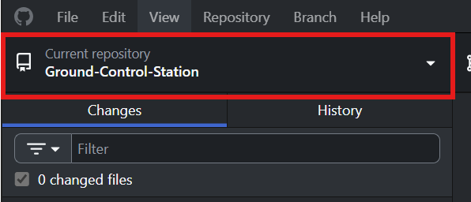
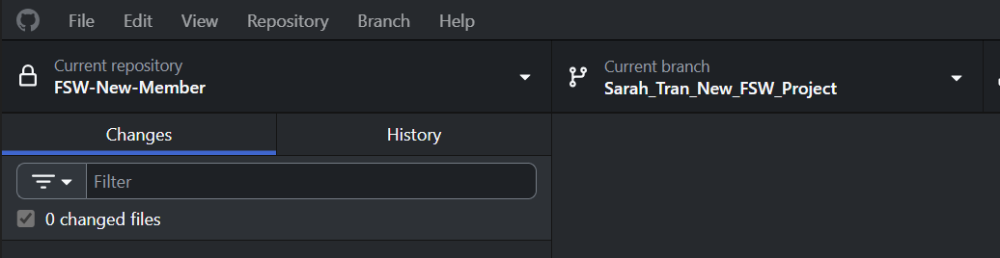
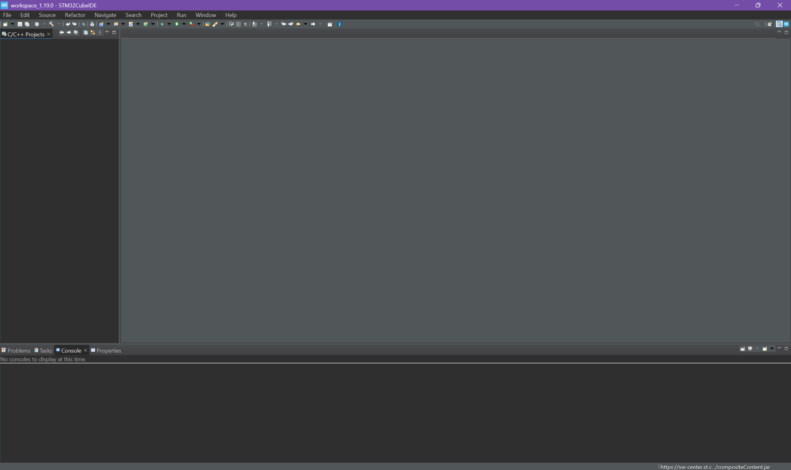
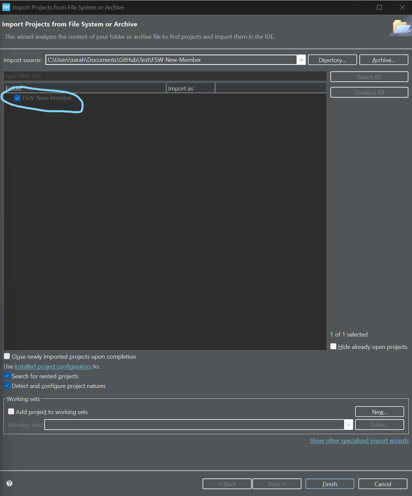
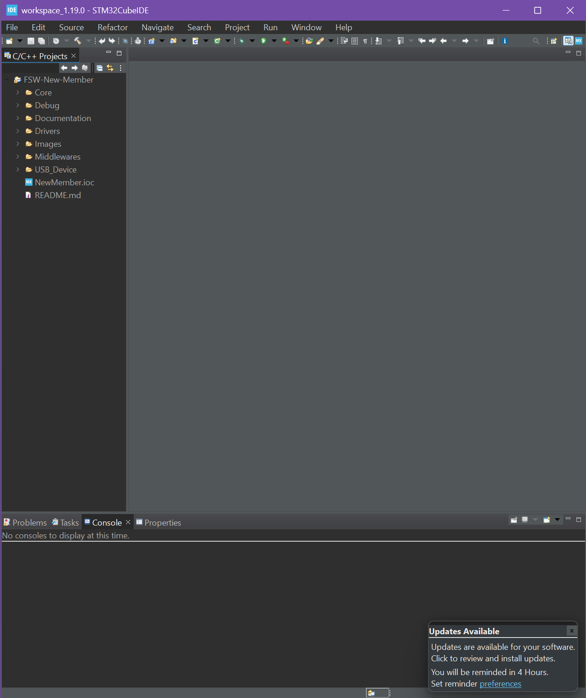

# FSW-New-Member
New member project for FSW to learn about STM32 by having members write a snesor driver in SPI and then using the data to an XBEE radio in USART.

Made by **Sarah Tran** and **Joel Kubinsky**.


## What will you be doing?
You will be learning about understanding an existing Real-Time Operating Systems with the STM32. Afterwards, you will be writing driver code to translate sensor information to something that the STM32 can use. That information is then going to be sent to an XBEE radio to show on a Ground Control Station (which you do not need to code).

We will also be walking you through important code structures that will be important to understand before writing the driver code. If you do not care about it for some reason, you can skip to [here](#writing-driver-code-for-sensors).

### Requirements:
- Understanding of a programming language (ideally C or C++). This project is done in C.
- [STM32CubeIDE](https://www.st.com/en/development-tools/stm32cubeide.html) (use a guest account with your UFL email).
- Git and GitBash

**NOTE**: STM32CubeIDE's website can be a little slow sometimes, try asking your team lead if they have a version downloaded already. If not, try again later.

We are using an **STM32**G491​RCT6 (as of 2025-2026 CanSat) and so requires the STM32CubeIDE to automate a lot of the code! **When asked which version, just go with the newest.**

## Table of Contents
[1. Cloning and Making a Branch from GitHub](#part-1:-cloning-and-making-a-branch-off-of-github)

[2. Importing an STM32 project](#part-2-importing-an-stm32-project)

[3. Writing a Driver for a Sensor](#part-3-writing-a-driver-for-a-sensro)

[4. Writing to the XBEEs](#part-4-writing-to-the-xbees)

## PART 1: Cloning and Making a Branch from GitHub
#### Basic Linux Commands + Shortcuts that you should know.
Commands
- ls (Print what is in your current directory/folder)
- cd (Change Directory. Change your current directory/folder)

Shortcuts
- TAB key (The Command Line Interface, CLI, will try to autofill with what it has)


We will be doing this on the Command Line and then there will be an optional link with GitHub.


1. Click on the green "Code".


2. Then the copy icon.

3. Opening the GitBash terminal, go to the directory that you want to put the GitHub repo into. Then you would want to do:
```
git clone <link>
```
where \<link> will be what you just copied from GitHub. "Enter" to send the command. This makes a local version of the GitHub repository for you to access.


4. Changing Directory to "FSW-New-Member", you should see that now you are on the "main" **branch**. A branch is like a version of the code and allows you to work independently from other people to work on something but then be able to **merge** branches together later on for collaboration. You DO NOT want to work on the main branch since you would want to make sure that your code works before having it be the definite version. A lot of repositories have restrictions that prevent you from sending new code to main, but that depends on group. We will now be making a new branch for you.

**Extra**: You are able to see other branches made by anyone by doing 
``` git branch ``` for local (on your computer branches) or ``` git branch -r ``` for branches by other users.

5. Make a new branch for this project by doing
```
git branch <name>
```
Replace \<name> with "\<FirstName>\_\<LastName>\_New_FSW_Project".

Now if you do ``` git branch ``` you should be able to see your new branch:


6. Move to that new branch by doing 
```
git checkout <name>
```
You should now see:


You are now able to open the project with an IDE like STM32CubeIDE and/or VSCode and start coding!

### Optional: Connecting your repo to GitHub Desktop application
Make sure you have done the instructions above for this. Also make sure that you are signed onto GitHub.

7. After opening GitHub desktop, click on this area to change repositories.


Then `click "Add" => "Add existing repository..." => "Choose"` then find the folder for this project. You'll know when you are in it when you see a ```.git``` folder in the current directory. Now do `Select Folder => Add repository`  

You should be able to see now that your Repository is `FSW-New-Member` and the Current Branch to the right is the branch that you made.



---
## PART 2: Importing an STM32 project
After opening a workspace, it should look something like this:

1. On the top left corner, click "File" -> "Open Projects from File Systems". Go to your FSW-New-Member folder. 

Make sure that you folder autofills the folder section like this:

2. Click Finish.

You should now be brought back to the main page with the new project on the side, like with VSCode.


## PART 3a: Writing a Driver for a Sensor (ICM42688P)
We are using a library called FreeRTOS which autogenerates a lot of the features like task scheduling using the ```NewMember.ioc```. So a lot of the files in the project are not very important for you to mess with. Though the following below are files or folders that you should take a read at and understand what is going on. 

- If the file is indented, it is indicating of which folder it is in.
- If just a folder is listed, that whole folder is something you should take a look at.
- Within the Core folder, the files have a mix of autogenerated code and user code. You can determine which one it is by seeing if the code is inbetween these tabs
```
/* USER CODE BEGIN ... */

/* USER CODE END ... */
```

1. Core/
   1. Inc/ 
      1. commands.h
      2. global.h
      3. main.h
   2. Src/
      1. commands.c
      2. global.c
      3. main.c
2. Drivers

For this specific project, you will be editing: 
- Drivers/ICM42688P/ICM42688PSPI.h
- Drivers/ICM42688P/ICM42688PSPI.c

By using the ICM42688P documentation in the `Documentation` and other sources that you can find, write the driver code that uses the sensor's SPI interface to send it's data through the `ICM42688P_AccelData` struct found in the `ICM42688SPI.h` file.

## PART 3b: Connecting the Driver
1. You need to include the ICM42688 Driver in main. Find where the other includes are and based it off it there.

#### What is RTOS?
Before we continue, you should know what RTOS is, including understanding what tasks and what scheduling is.

An **RTOS (Real-Time Operating System)** makes sure that tasks that we want to do are completed by a specific **deadline** if needed. Timing is critical because it may lead to system failure, unsafe behavior, or missed specification. For example, for the CanSat competition, telemetry data HAS to be sent to the Gound Control Station at 1 Hz (every 1 second). So we would need a system that is able to **schedule** this task every second and and find things to fill inbetween each send. A **scheduler** manages these tasks, deciding which ones to run and when based on parameters like **priority** (how urgent the task is) and **period** (how often it runs, like every second). We are using FreeRTOS, provided by STM32CubeIDE which does most of the work for us, so all we have to do intialize the tasks, its parametears, and specify what the tasks to.

For the new member project, there is currently two task already intialized. 1) StartReadSensors which reads each of our sensors and 2) StartComms which checks to see if a command has been sent from the Ground Control Station. **For this section, you will be writing code for the StartReadSensors task.**

2. Find the StartReadSensors task and use the sensor driver that you just wrote to set values in the globalData struct (found in global.h and global.c). 

## PART 4: Writing to the XBEEs
(TO BE WRITTEN)

## Writing Driver Code for Sensors
SPI     - Reading ICM42688\
USART   - Writing to XBEEs

## Notes for Sarah
Are we going to have them make a new task??????

`osStatus osSemaphoreWait (osSemaphoreId semaphore_id, uint32_t millisec)`
`osStatus osSemaphoreRelease (osSemaphoreId semaphore_id)`

## Extra Resources
- Learn more about [SPI](https://youtu.be/MBwtJhO6b0I?si=Nb-yW6-bYA13eYJV) and [USART](https://youtu.be/fkVYkDuB_38?si=hZDJfQHnWz25cNov) from Dr. Schwartz here at UF.
  